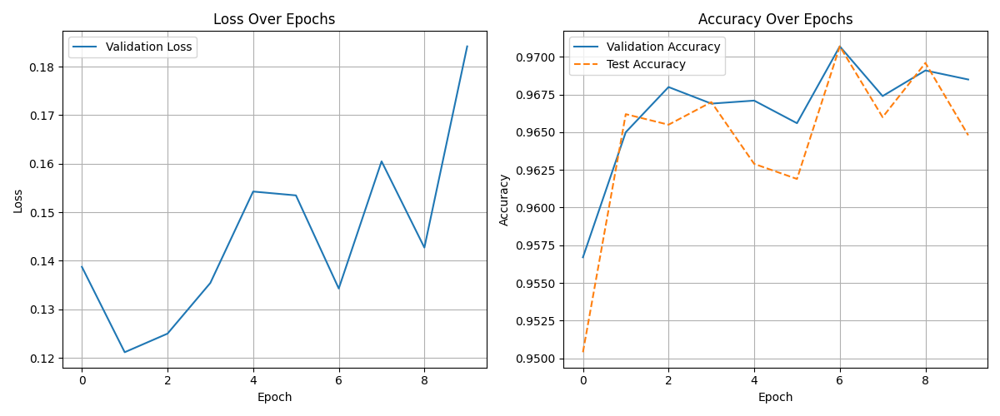

# jax-mnist-mlp

> [!NOTE]  
> 이 프로젝트는 [JAX](https://github.com/google/jax) 라이브러리를 사용하여 MNIST 손글씨 숫자 데이터를 분류하는 **Multi-Layer Perceptron (MLP)** 모델을 구현한 예제입니다. 학습에는 `Optax` 옵티마이저를 사용하며, 학습 및 평가 결과는 시각화됩니다.

---

## 📦 프로젝트 구조

```bash
jax_mnist_mlp/
├── main.py # 실행 진입점
├── config.py # 설정값 및 하이퍼파라미터
├── data/
│ └── loader.py # MNIST 데이터셋 로딩
├── models/
│ └── mlp.py # MLP 모델 정의
├── utils/
│ ├── training.py # 학습 루프 및 옵티마이저 적용
│ ├── metrics.py # 손실/정확도 함수
│ ├── optimizer.py # Optax 옵티마이저 초기화
│ └── plotting.py # 학습 곡선 시각화
├── logs/
│ └── result.png # 학습 정확도/손실 그래프 저장
├── .gitignore
└── README.md
```

---

## 🧪 기능

- [x] MLP 모델 수동 정의 (레이어 구성: 784 → 256 → 128 → 10)
- [x] Optax를 활용한 optimizer (SGD, Adam 등)
- [x] Validation / Test Accuracy 추적 및 출력
- [x] 시각화: Loss, Validation Accuracy, Test Accuracy 그래프
- [x] JAX의 `jit`, `grad`, `value_and_grad` 사용 최적화

---

## 🚀 실행 방법

### 1. 설치

```bash
git clone https://github.com/givemechocopy/jax-mnist-mlp.git
cd jax-mnist-mlp
python -m venv .venv
source .venv/bin/activate	# MacOS 
.venv\Scripts\activate 	# Windows
pip install -r requirements.txt
```

### 2. 실행

```bash
python main.py
```

## 🖼️ 학습 결과



## 📚 사용 기술

-   **JAX**: 자동 미분, XLA 기반 연산 가속
-   **Optax**: JAX용 옵티마이저 라이브러리
-   **Matplotlib**: 학습 곡선 시각화
-   **Torchvision**: MNIST 데이터셋 다운로드

------

## ⚙️ 설정값 (`config.py`)

```python
config = {
    "key": jax.random.PRNGKey(0),
    "model_arch": [784, 256, 128, 10],
    "batch_size": 128,
    "epochs": 10,
    "learning_rate": 0.01
}
```

------

## 📌 참고

-   [JAX 공식 문서](https://jax.readthedocs.io)
-   [Optax GitHub](https://github.com/deepmind/optax)

## 📜 라이선스

MIT License